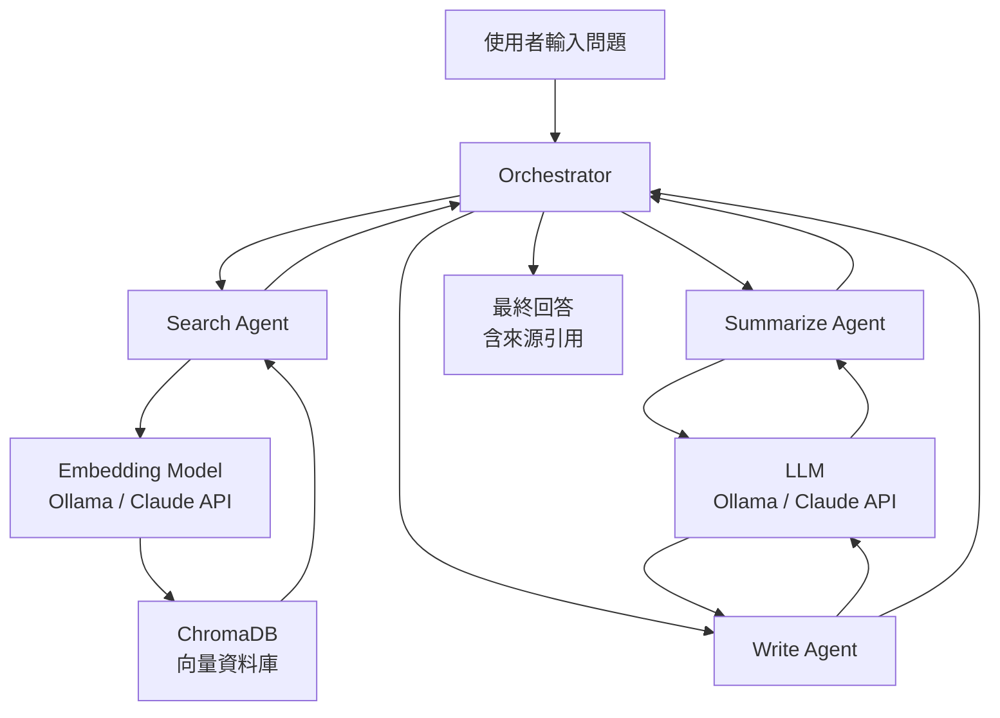
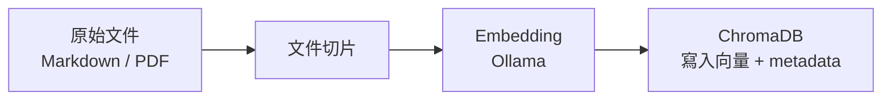

# 資料流向圖

## 查詢流程（Query Flow）

## 語料匯入流程（Ingest Flow）

## 資料來源說明

| 來源 | 格式 | 更新頻率 | 負責人 |
|------|------|----------|--------|
| 方法論文件 | Markdown（半結構化） | 手動，按需 | 知識管理部 PM（林雅婷） |
| 案例研究摘要 | Markdown | 手動，每季 | 知識管理部 PM |
| 產業報告 | PDF 轉文字 | 手動，不定期 | 各顧問自行上傳（Phase 2） |

## 各版本資料儲存差異

| 版本 | ChromaDB 儲存位置 | 重啟後資料保留 |
|------|-------------------|---------------|
| v1 | 本機目錄（`./chroma_data`） | 是（本地檔案） |
| v2a | Docker named volume | 是（volume 存活） |
| v2b | PersistentVolumeClaim（K8s） | 是（PVC 獨立於 Pod） |
| v3 | 雲端儲存（待定） | 是 |

## 相關連結

- [[04_Data/資料字典]]
- [[04_Data/主數據清單]]
- [[03_Technology/1.8_Cloud_Infra/雲端架構與部署]]
